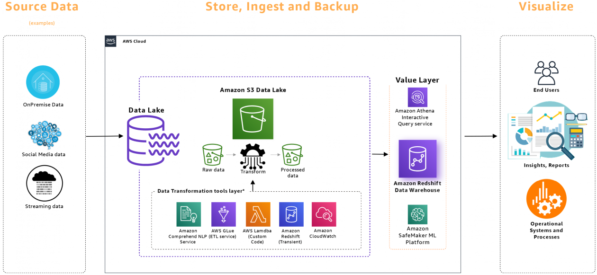
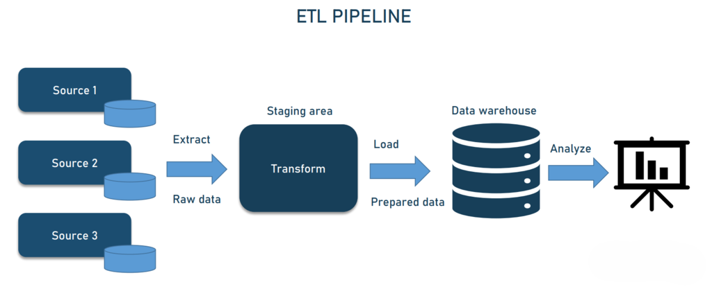
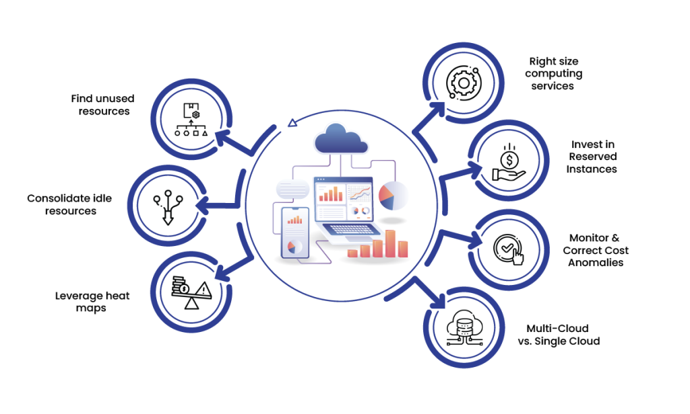
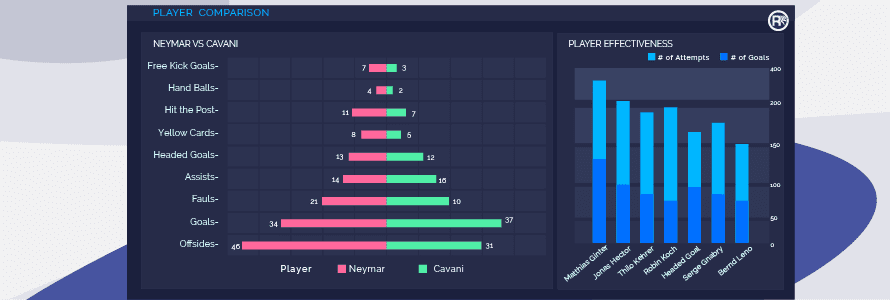
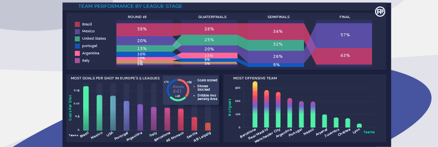

# Data Engineer

📝 **Summary** 
Experienced Data Science Engineer with 4+ years of expertise in developing and optimizing cloud-native data pipelines and machine learning models across <strong>AWS</strong> and <strong>Azure</strong>. Skilled in integrating and processing large-scale structured and unstructured data to enhance business intelligence and analytics capabilities, resulting in a remarkable <strong>25% improvement</strong> in data processing efficiency. Acknowledged for exceptional collaborative problem-solving skills and team mentoring abilities, consistently leading successful data transformation projects and facilitating data-driven decision-making.

---

## 🛠️ Technical Skills

- **Languages:** SQL, Python
- **Cloud Platforms:** AWS, Azure
- **Machine Learning:** Azure ML, Data Bricks
- **Data Engineering:** Data Factory, AWS Glue, Power BI
- **Databases & Warehousing:** AWS RDS, Azure SQL Database, PostgreSQL, Cosmos DB
- **Others:** Kafka, Lambda, Step Functions

---

## 💼 Work Experience

| Role                                | Organization                         | Location         | Duration               |
|-------------------------------------|--------------------------------------|------------------|------------------------|
| **Data Engineer**                   | OEC India Services Private Limited   | Chennai, India   | December 2022 – Present|
| **Associate Data Science Engineer** | OEC India Services Private Limited   | Krakow, Poland   | Sept 2022 – Nov 2022   |
| **Associate Data Science Engineer** | OEC India Services Private Limited   | Chennai, India   | Sept 2021 – Aug 2022   |
| **Associate Machine Learning Engineer** | Cricketronics Pvt Ltd             | Chennai, India   | Jan 2021 – Sept 2021   |

---

## 📈 Key Responsibilities, Achievements

### **Data Engineer** at OEC India Services (Dec 2022 – Present)
- Designed and optimized **cloud-based data pipelines** on **AWS** and **Azure**, focusing on scalability and resilience.
- Led multiple data transformation projects, resulting in a **20% reduction** in processing time and enhancing system performance.
- Collaborated with cross-functional teams to build and maintain cloud-native architectures, improving system uptime by **15%**.
- Mentored junior engineers, fostering a culture of knowledge-sharing and high-performance teamwork, which led to an **increase in team productivity by 25%**.
  
### **Associate Data Science Engineer** at OEC India Services (Sept 2022 – Nov 2022)
- Developed and deployed **machine learning models** to improve predictive analytics for business insights, driving **25%** improvement in decision-making accuracy.
- Designed and integrated data pipelines using **Azure Data Factory** and **Cosmos DB**, enabling **real-time data ingestion** and **BI reporting**.
- Enhanced data warehousing solutions, optimizing data retrieval for **Power BI** dashboards and improving data accessibility by **30%**.
- Worked closely with stakeholders to optimize business intelligence data pipelines, improving performance and reliability.
  
### **Associate Data Science Engineer** at OEC India Services (Sept 2021 – Aug 2022)
- Automated data cleaning and transformation tasks using **AWS Glue**, **Lambda**, and **Step Functions**, streamlining workflows and reducing manual processing by **30%**.
- Implemented interactive data visualizations using **Power BI**, which improved reporting speed and reduced time to insights by **40%**.

### **Associate Machine Learning Engineer** at Cricketronics Pvt Ltd (Jan 2021 – Sept 2021)
- Developed **machine learning models** for player performance prediction and injury risk assessment, utilizing historical game and biometric data.
- Implemented feature engineering techniques to enhance model accuracy, resulting in a **25% improvement** in injury prediction accuracy.
- Deployed production-ready models that enabled **proactive workload management**, reducing injury rates by **18%**.

---

## **📌 Featured Projects**

### 1. **AWS and Azure Pipeline Architecture**

- Designed and implemented scalable, resilient data architecture for both **AWS** and **Azure** pipelines, ensuring efficient data processing at scale.
- Managed **data ingestion** using **AWS Glue** to process shop status data from **S3**, including retries, notifications, and comprehensive monitoring via **CloudWatch**.
- Built a cost-effective **Data Lake** on **S3**, ensuring data availability for downstream applications and enhancing data accessibility by **40%**.
- Developed a secure **Data Warehouse** on **AWS RDS (PostgreSQL)** with private subnet connections, improving data security and analytics capabilities.

### 2. **Azure Data Integration & Reporting Pipeline**

- Built a real-time **Kafka-to-Cosmos DB** data pipeline using **Python** and **Azure Data Factory**, enhancing BI reporting efficiency and data accessibility.
- Integrated **Cosmos DB** with **Azure Data Factory** to enable long-term data storage and optimized analytics for **Power BI**.
- Automated data transformations that reduced BI reporting time by **40%** and provided business stakeholders with timely insights for better decision-making.

### 3. **Vehicle Damage Detection using Azure Cognitive Services**

- Developed a **machine learning model** using **Azure Cognitive Vision** to automatically detect vehicle damage, optimizing insurance claim processing.
- Reduced claim assessment time by **40%** and improved accuracy in damage evaluation, streamlining operations for insurers.
- Automated the detection of damage, enabling quick, data-driven decision-making that accelerated claim processing.

### 4. **Cross-Platform Data Pipeline for Reporting & Analytics**

- Designed an integrated **AWS** and **Azure** data pipeline to process multiple data sources, such as **Azure Blob Storage**, **APIs**, and **CSV uploads**.
- Reduced **data prep time by 30%** using **Azure Data Factory** and multi-source integration, enabling faster data processing.
- Built scalable **ETL pipelines** using **AWS Glue**, **Lambda**, and **Step Functions** to transform large datasets efficiently.

### 5. **Player Performance Prediction and Injury Risk Assessment**

- Developed predictive models to assess player performance and injury risk, achieving a **25% improvement** in prediction accuracy using **XGBoost** and **Random Forest**.
- Conducted extensive **feature engineering** and exploratory data analysis (**EDA**) to identify key factors influencing performance and injuries.
- Enabled proactive workload management for teams, reducing injury rates by **18%** and improving player health.

### 6. **Game Outcome Prediction and Team Performance Insights**

- Built advanced predictive models to forecast game outcomes and analyze team performance using statistical techniques.
- Achieved **85% accuracy** in game outcome predictions using a **Logistic Regression** model.
- Delivered actionable insights to coaching staff, which improved strategic decision-making and team performance by **30%**.

---
## 🎓 Education

| Degree                                | Institution            | Year         |
|---------------------------------------|-----------------------|--------------|
| **Masters in Data Science**           | Loyola College Chennai | 2019 – 2021  |
| **Bachelor of Computer Applications** | Loyola College Chennai | 2016 – 2019  |

---

## 📬 Contact

- **Email:** [navinfranklin11@gmail.com](mailto:navinfranklin11@gmail.com)
- **LinkedIn:** [Navin Franklin](https://www.linkedin.com/in/navin-franklin/)

---
